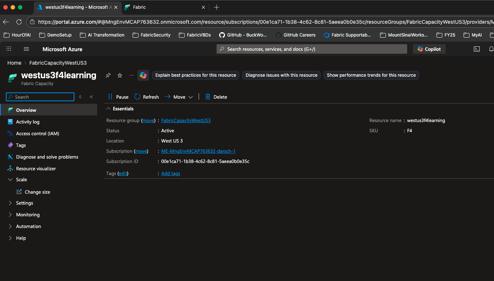
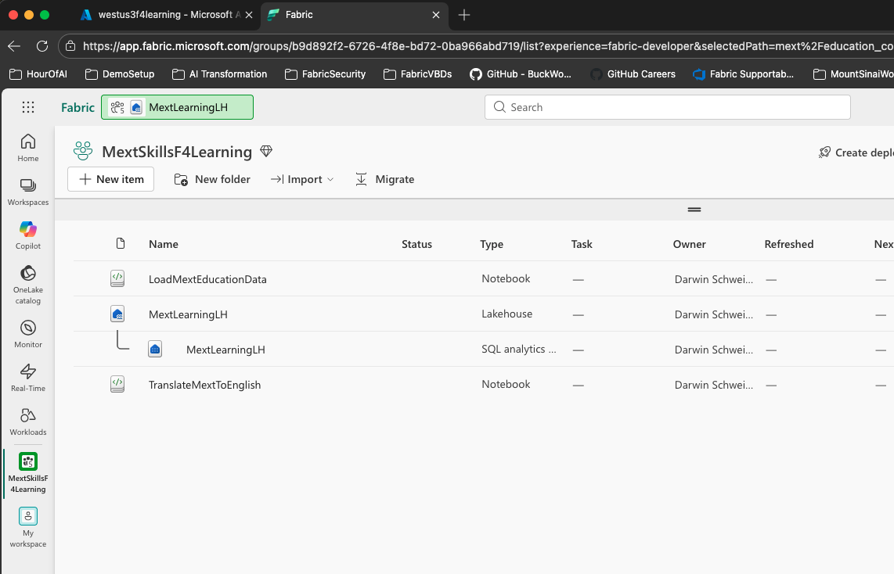
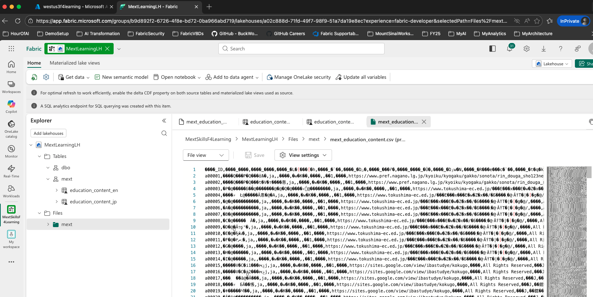
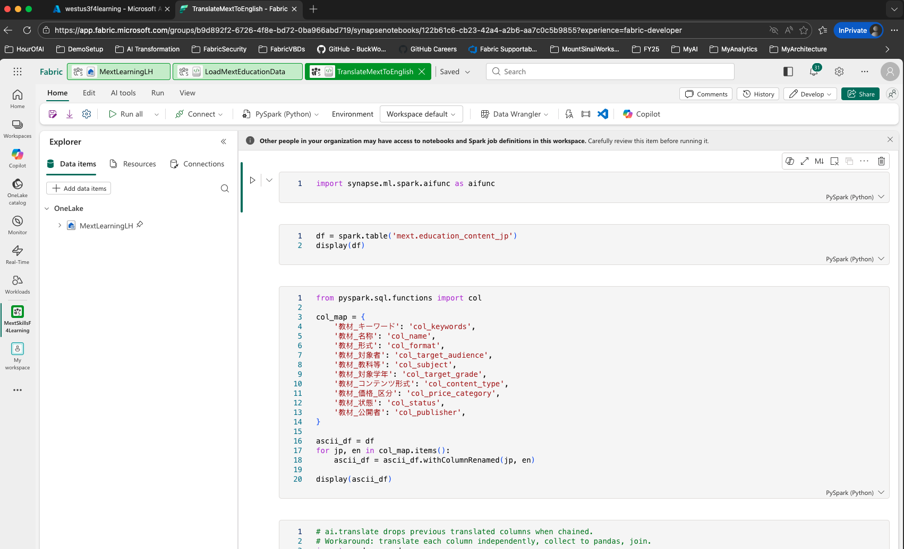
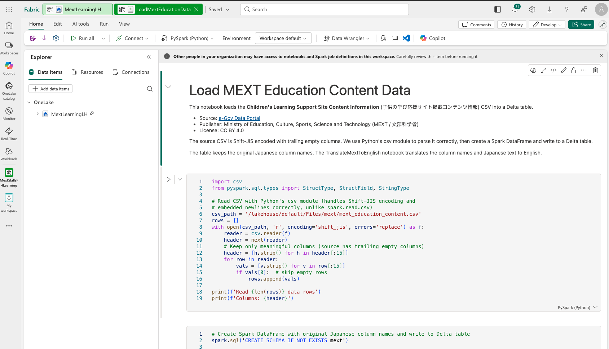
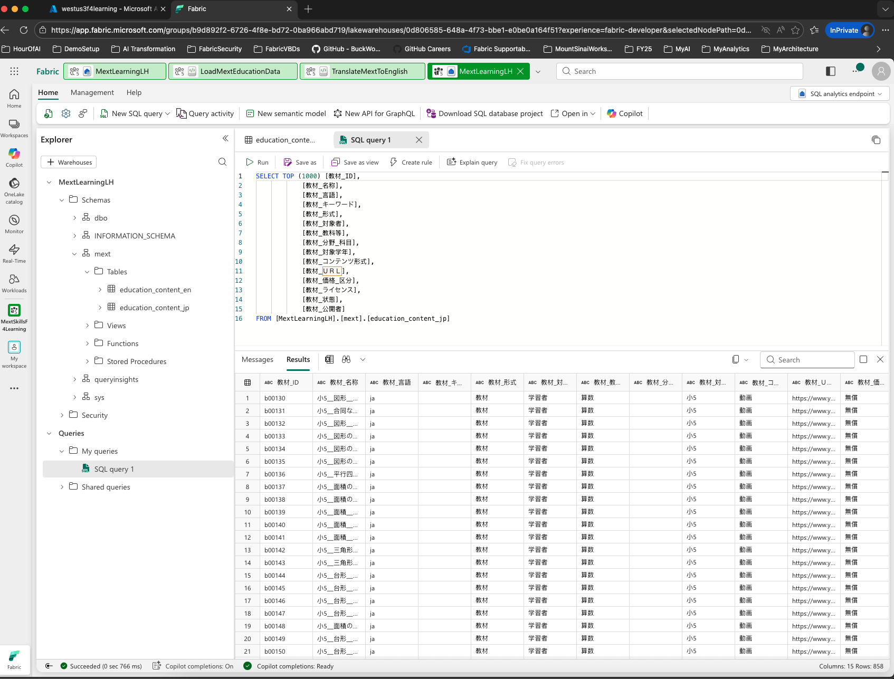

# MEXT 教育コンテンツデータの読み込み — エンドツーエンドガイド

このガイドでは、Azure CLI と Fabric REST API を使用して Microsoft Fabric のインフラストラクチャをプロビジョニングし、[子供の学び応援サイト掲載コンテンツ情報](https://data.e-gov.go.jp/data/en/dataset/mext_20210222_0025)（約887行）を Delta テーブルに読み込む手順を説明します。

> これは [skills-for-fabric-load-medicare-data](https://github.com/DataSnowman/skills-for-fabric-load-medicare-data) の簡易学習版です。2億7500万行の Medicare データの代わりに、1つの小さな CSV と2つのノートブックを使用します。Fabric のデプロイワークフローと AI 関数を学ぶのに最適です。

> このプロジェクトは [GitHub Copilot CLI](https://docs.github.com/en/copilot) と [Claude Code](https://docs.anthropic.com/en/docs/claude-code) を使用し、[microsoft/skills-for-fabric](https://github.com/microsoft/skills-for-fabric) のスキルとコンテキストを活用して構築されました。

> **🇺🇸 English README: [README.en.md](README.en.md)**

## データセットについて

データは**文部科学省（MEXT）**が公開する「子供の学び応援サイト」の教育コンテンツメタデータです。約998件の教育動画コンテンツの情報が含まれています。

| 項目 | 説明 |
|---|---|
| **データソース** | [e-Gov データポータル](https://data.e-gov.go.jp/data/en/dataset/mext_20210222_0025) |
| **公開者** | 文部科学省 |
| **ライセンス** | CC BY 4.0 |
| **行数** | 約998行 |
| **文字コード** | Shift-JIS |
| **教科** | 国語、算数、数学、理科、社会、外国語 |
| **対象学年** | 小学1年～小学6年、中学1年～中学3年 |

### CSV の列

| 列名 | 説明 |
|---|---|
| 教材_ID | コンテンツの一意な識別子 |
| 教材_名称 | 学習コンテンツのタイトル |
| 教材_言語 | 言語コード（ja） |
| 教材_キーワード | 検索キーワード |
| 教材_形式 | コンテンツの分類（教材） |
| 教材_対象者 | 対象者（学習者） |
| 教材_教科等 | 教科（国語、算数など） |
| 教材_分野_科目 | 分野・科目 |
| 教材_対象学年 | 対象学年（小1～中3） |
| 教材_コンテンツ形式 | メディア形式（動画） |
| 教材_ＵＲＬ | コンテンツの公開URL |
| 教材_価格_区分 | 無償/有償 |
| 教材_ライセンス | コンテンツのライセンス |
| 教材_状態 | 公開状態 |
| 教材_公開者 | 公開組織 |

## 前提条件

- **GitHub Copilot CLI**（[インストール方法](https://docs.github.com/en/copilot/how-tos/copilot-cli/set-up-copilot-cli/install-copilot-cli)）または **Claude Code**（[クイックスタート](https://code.claude.com/docs/en/quickstart)）
- **Azure CLI** がインストール済み（`az --version`）
- Azure に**ログイン**済み（`az login`）
- **Python 3.9+**（`python3 --version`）
- **Bash シェル** — macOS ターミナル、Linux シェル、または Windows WSL/Git Bash
- **Microsoft Fabric** — リソースグループと [Fabric キャパシティ](https://learn.microsoft.com/ja-jp/fabric/enterprise/licenses)（F4以上）を作成する権限を持つ Azure サブスクリプション
- **curl**（CSV ダウンロード用）

> **Windows ユーザー:** スクリプトは [WSL](https://learn.microsoft.com/ja-jp/windows/wsl/install) または Git Bash で実行してください。ネイティブ PowerShell はサポートされていません。

## 設定

すべての設定は [`config/variables.md`](config/variables.md) で管理されます。**スクリプト実行前にこのファイルを編集してください。**

| 変数 | 説明 |
|---|---|
| `RESOURCE_GROUP` | Azure リソースグループ名 |
| `LOCATION` | Azure リージョン（例：`westus3`） |
| `SKU` | Fabric キャパシティ SKU（`F4`以上） |
| `CAPACITY_NAME` | グローバルで一意、小文字英数字 |
| `WORKSPACE_NAME` | Fabric ワークスペースの表示名 |
| `LAKEHOUSE_NAME` | 作成するレイクハウス名 |

```bash
# Azure
RESOURCE_GROUP="FabricCapacityWestUS3"
LOCATION="westus3"
SKU="F4"

# Fabric
CAPACITY_NAME="westus3f4skillsflearning"
WORKSPACE_NAME="MextSkillsF4Learning"
LAKEHOUSE_NAME="MextLearningLH"
```

## クイックスタート

### ステップ 1 — リポジトリのクローン

```bash
git clone https://github.com/DataSnowman/skills-for-fabric-learning.git
```

### ステップ 2 — リポジトリディレクトリに移動

```bash
cd skills-for-fabric-learning
```

### ステップ 3 — 設定の編集

`config/variables.md` を編集し、キャパシティ、ワークスペース、レイクハウスの名前を設定します。CSV は自動的にダウンロードされます。

### ステップ 4 — デプロイの実行

#### 方法 A: シェルスクリプト（コマンド1つ）

```bash
chmod +x deploy-mext-e2e.sh
./deploy-mext-e2e.sh
```

#### 方法 B: AI エージェント

GitHub Copilot CLI または Claude Code を開き、コンテキストファイルを指定します：

```
context/loadMextData.md の手順と config/variables.md の設定を使用して、
MEXT 教育 CSV データを Fabric レイクハウスに読み込んでください。
notebooks/LoadMextEducationData.ipynb のノートブックをデプロイしてください。
```

## スクリプトの動作

| ステップ | 説明 |
|---|---|
| 0 | 事前チェック（Azure ログイン、ノートブックの存在確認） |
| 1 | MEXT ウェブサイトから CSV をダウンロード |
| 2 | Azure リソースグループの作成 |
| 3 | Fabric キャパシティの作成（F4） |
| 4 | Fabric ワークスペースの作成 |
| 5 | レイクハウスの作成 |
| 6 | CSV を OneLake にアップロード |
| 7 | レイクハウスバインディング付きでノートブックをデプロイ |
| 8 | データ読み込みノートブックの実行（CSV → `mext.education_content_jp` Delta テーブル） |
| 9 | 翻訳ノートブックの実行（AI翻訳 → `mext.education_content_en`） |
| 10 | Delta テーブルの存在確認 |

## リポジトリ構成

```
skills-for-fabric-learning/
├── README.md                              ← 日本語版 README（このファイル）
├── README.en.md                           ← 英語版 README
├── config/
│   └── variables.md                       ← デプロイ設定
├── context/
│   └── loadMextData.md                    ← AI エージェント用コンテキストファイル
├── data/
│   └── putfileshere.txt                   ← （CSV は自動ダウンロード）
├── notebooks/
│   ├── LoadMextEducationData.ipynb        ← CSV → 日本語 Delta テーブル
│   └── TranslateMextToEnglish.ipynb       ← AI翻訳 → 英語 Delta テーブル
├── deploy-mext-e2e.sh                     ← エンドツーエンドデプロイスクリプト
├── pyproject.toml
└── .gitignore
```

## Fabric のスクリーンショット

Fabric キャパシティ



Fabric ワークスペース



Fabric レイクハウスのファイルとテーブル



Fabric ノートブック





Fabric SQL 分析エンドポイント



## 結果の確認

デプロイ後、Fabric SQL で両方の Delta テーブルをクエリできます：

**日本語テーブル：**
```sql
SELECT `教材_教科等` AS subject, COUNT(*) AS count
FROM [MextLearningLH].[mext].[education_content_jp]
GROUP BY `教材_教科等`
ORDER BY count DESC
```

**英語テーブル（AI翻訳済み）：**
```sql
SELECT material_subject AS subject, COUNT(*) AS count
FROM [MextLearningLH].[mext].[education_content_en]
GROUP BY material_subject
ORDER BY count DESC
```

## トラブルシューティング

| 問題 | 解決方法 |
|---|---|
| `az login` が失敗する | `az login` を実行し、ブラウザの指示に従ってください |
| キャパシティ作成が失敗する | サブスクリプションに Fabric キャパシティの作成権限があることを確認してください |
| CSV ダウンロードが失敗する | インターネット接続を確認するか、手動で `data/` にダウンロードしてください |
| ノートブックジョブが失敗する | Fabric キャパシティが F4 以上であることを確認してください（F2 では Spark リソースが不足します） |
| 翻訳ノートブックが失敗する | Fabric キャパシティで AI 関数（Copilot）が有効になっていることを確認してください。ランタイム 1.3 以上が必要です |
| Delta テーブルが見つからない | 数分待ってから確認ステップを再実行してください |
| Shift-JIS エンコーディングエラー | ノートブックが自動的にエンコーディングを処理します。CSV が変更されていないことを確認してください |

## 関連プロジェクト

- **[skills-for-fabric-load-medicare-data](https://github.com/DataSnowman/skills-for-fabric-load-medicare-data)** — 2億7500万行の Medicare データを使用した本格版
- **[microsoft/skills-for-fabric](https://github.com/microsoft/skills-for-fabric)** — Microsoft Fabric 用の再利用可能な AI スキル
- **[DataSnowman/fabriclakehouse](https://github.com/DataSnowman/fabriclakehouse)** — GUI ベースの Fabric ウォークスルー（オリジナル版）
